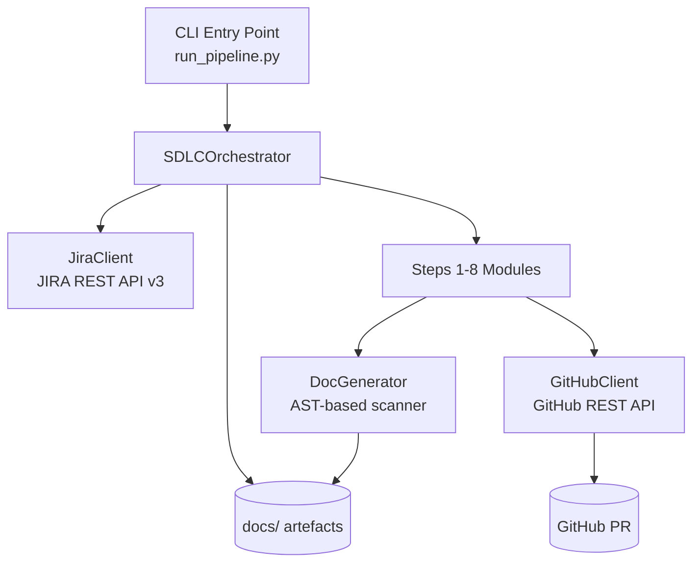
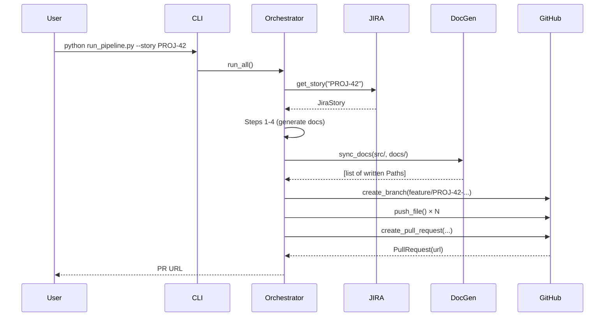
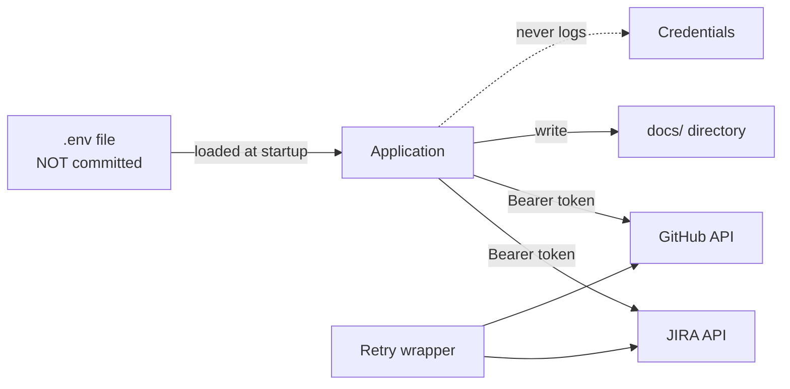

# Architecture — Automated Documentation Sync Pipeline

> Generated: 2026-08-02

## Overview

The system is a Python 3.11+ CLI/library that orchestrates an 8-step SDLC pipeline.
It integrates with JIRA (story input), scans source code (documentation extraction),
and integrates with GitHub (PR output). All steps are driven by Copilot agents and prompts.

## Component Diagram



## Data Flow



## Component Responsibilities

| Component | Module | Responsibility |
|-----------|--------|----------------|
| CLI | `run_pipeline.py` | Parse args, build config, invoke orchestrator |
| Orchestrator | `src/pipeline/orchestrator.py` | Sequence steps, manage state |
| JiraClient | `src/pipeline/jira_client.py` | Fetch & parse JIRA stories |
| GitHubClient | `src/pipeline/github_client.py` | Create branches, push files, open PRs |
| DocGenerator | `src/pipeline/doc_generator.py` | AST scan → Markdown |
| Steps 1-8 | `src/steps/step*.py` | Generate each SDLC artefact |
| Hooks | `hooks/` | Pre/post commit safety checks |

## Technology Choices

| Choice | Library | Rationale | NFR |
|--------|---------|-----------|-----|
| HTTP client | `httpx` | Sync + async, explicit timeouts, wide adoption | NFR-01, NFR-03 |
| Config | `python-dotenv` | Zero-dependency env file loading | NFR-02 |
| AST parsing | stdlib `ast` | No extra dependency; stable API | NFR-04 |
| Testing | `pytest` + `pytest-cov` | Industry standard; rich plugin ecosystem | NFR-04 |
| Retry transport | `httpx.HTTPTransport(retries=3)` | Minimal deps; handles transient 5xx | NFR-03 |

## Security Boundaries



- All credentials loaded exclusively from environment variables.
- No credential is ever written to a generated document or log line.
- JIRA and GitHub clients use HTTPS only.
- Retry wrapper added around all external API calls (addresses design review finding #1).

## Deployment View

```
Developer workstation / CI runner
└── Python 3.11 virtualenv
    ├── run_pipeline.py
    ├── src/
    └── .env  ← gitignored; set in CI as secrets
```

CI: GitHub Actions (`sdlc-pipeline.yml`) — triggered on push to feature branches.
